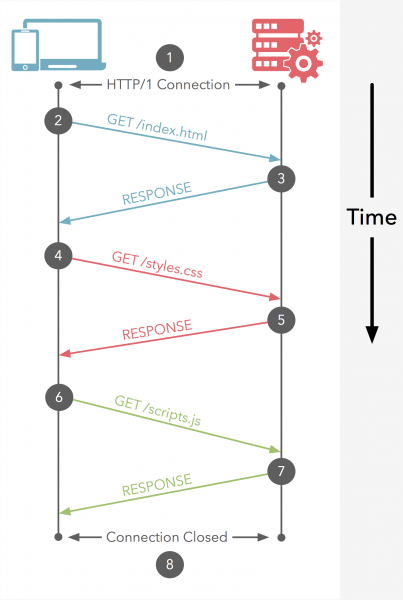

# HTTP2(HyperText Transfer Protoco)
HTTP는 1996년 처음 1.0버전이 release되고 1999년 현재 우리가 공식적으로 가장 많이 사용하고 지원하는 버전인 1.1이 출시된 이후 15년동안 발전없이 사용되고 있습니다.  

## HTTP/1.1 동작방식
HTTP는 웹상에서 Client ( Internet Explorer, Chrome, Firefox) 와 Server ( 웹서버 eg: httpd, nginx, etc...)간 통신을 위한 Protocol 입니다.  

 
HTTP/1.1는 기본적으로 Connection당 하나의 요청을 처리 하도록 설계 되어 있습니다.  
그래서 위 그림과 같이 동시전송이 불가능하고 요청과 응답이 순차적으로 이루어 지게 됩니다.  
그렇다 보니 HTTP문서안에 포함된 다수의 리소스 (Images, CSS, Script)를 처리하려면 요청할 리소스 개수에 비례해서 Latency(대기 시간)는 길어지게 됩니다.  

## HOL (Head Of Line) Blocking - 특정 응답의 지연
1. HTTP의 HOL Blocking
1. TCP의 HOL Blocking

### HTTP의 HOL Blocking
순서대로 첫번째 이미지를 요청하고 응답받고 다음 이미지를 요청하게 되는데 만약 첫번째 이미지를 요청하고 응답이 지연되면 두,세번째 이미지는 당연히 첫번째 이미지의 응답처리가 완료되기 전까지 대기하게 되며 이와 같은 현상을 HTTP의 Head of Line Blocking 이라 부르며 파이프 라이닝의 큰 문제점 중 하나 입니다.  

- RTT( Round Trip Time ) 증가
> http/1.1의 경우 일반적으로 하나의 connection에 하나의 요청을 처리 합니다.  이렇다 보니 매 요청별로 connection을 만들게 되고 TCP상에서 동작하는 HTTP의 특성상 3-way Handshake 가 반복적으로 일어나고 또한 불필요한 RTT증가와 네트워크 지연을 초래하여 성능을 저하 시키게 됩니다.  

- 무거운 Header 구조 (특히 Cookie)
> 어쩔땐 요청을 통해서 전송하려는 값보다 헤더 값이 더 큰경우도 비일비재 합니다.  

### 해결 방안
- Image Spriting
> 웹페이지를 구성하는 다양한 아이콘 이미지 파일의 요청 횟수를 줄이기 위해 아이콘을 하나의 큰 이미지로 만든다음 CSS에서 해당 이미지의 좌표 값을 지정해 표시한다.  

- Domain Sharding
> 요즘 브라우저들은 http/1.1이 단점을 극복하기 다수의 Connection을 생성해서 병렬로 요청을 보내기도 합니다.  
> 하지만 브라우저 별로 Domain당 Connection개수의 제한이 존재하고 이 또한 http/1.1의 근본 해결책은 아닙니다.  

- Minify CSS/Javascript
> http를 통해서 전송되는 데이터의 용량을 줄이기 위해 CSS, Javascript 코드를 축소하여 적용하기도 합니다.  

- Data URI Scheme
> Data URI 스킴은 HTML문서내 이미지 리소스를 Base64로 인코딩된 이미지 데이터로 직접 기술하는 방식이고 이를 통해 요청 수를 줄이기도 합니다.  

- Load Faster
> 스타일시트를 HTML 문서 상위에 배치  
> 스크립트를 HTML문서 하단에 배치  

## SPDY
이런 우리의 눈물겨운 노력들도 HTTP/1.1 단점을 근본적으로 해결 할 수 는 없었고 구글은 더 빠른 Web을 실현하기 위해 throughput 관점이 아닌 Latency 관점에서 HTTP를 고속화한 SPDY(스피디) 라 불리는 새로운 프로토콜을 구현하였습니다.  
다만 SPDY는 HTTP를 대치하는 프로토콜이 아니고 HTTP를 통한 전송을 재 정의하는 형태로 구현이 되었습니다.  
SPDY는 실제로 HTTP/1.1에 비해 상당한 성능 향상과 효율성을 보여줬고 이는 HTTP/2 초안의 참고 규격이 되게 됩니다.  

## HTTP/2
HTTP/2는 앞서 설명한것 처럼 SPDY를 기반으로 http2 작업그룹이  2012년 10월 부터 시작한 새로운 프로토콜 구현 프로젝트 입니다.  
HTTP/2는 HTTP가 유선상에서 표현 방법을 대치 하는것입니다.  
이것은 프로토콜을 완전히 다시 작성하는게 아니라 HTTP 메소드, 상태 코드 및 의미는 동일하며 프로토콜을 나타 내기 위해 HTTP/ 1.x와 동일한 API (일부 작은 추가 기능 포함)를 사용 할 수 있어야 합니다.  
<b>HTTP/2의 초점은 성능에 있습니다.</b>  
특히 최종 사용자가 대기 시간, 네트워크 및 서버 리소스 사용을 인식합니다.  
주요 목표 중 하나는 브라우저에서 웹 사이트로의 단일 연결을 허용하는 것입니다.  
> 완전히 새로운 프로토콜을 만들었기 보단 성능향상에 초점을 맞춘 프로토콜 입니다.  

- Multiplexed Streams
한 커넥션으로 동시에 여러개의 메세지를 주고 받을 있으며, 응답은 순서에 상관없이 stream으로 주고 받습니다.  
HTTP/1.1의 Connection Keep-Alive, Pipelining의 개선이라 보면 됩니다.  

- Stream Prioritization
클라이언트가 요청한 HTML문서안에 CSS파일 1개와 Image파일 2개가 존재하고 이를 클라이언트가 각각 요청하고 난 후 Image파일보다 CSS파일의 수신이 늦어지는 경우 브라우저의 렌더링이 늦어지는 문제가 발생하는데 HTTP/2의 경우 리소스간 의존관계(우선순위)를 설정하여 이런 문제를 해결하고 있습니다.

- Server Push
서버는 클라이언트의 요청에 대해 요청하지도 않은 리소스를 마음대로 보내줄 수 도 있습니다.  
> 클라이언트(브라우저)가 HTML문서를 요청했고 해당 HTML에 여러개의 리소스(CSS, Image...) 가 포함되어 있는경우 HTTP/1.1에서 클라이언트는 요청한 HTML문서를 수신한 후 HTML문서를 해석하면서 필요한 리소스를 재 요청하는 반면 HTTP/2에선 Server Push기법을 통해서 클라이언트가 요청하지도 않은 (HTML문서에 포함된 리소스) 리소스를 Push 해주는 방법으로 클라이언트의 요청을 최소화 해서 성능 향상을 이끌어 냅니다.  
> 이를 PUSH_PROMISE 라고 부르며 PUSH_PROMISE를 통해서 서버가 전송한 리소스에 대해선 클라이언트는 요청을 하지 않습니다.  

- Header Compression
HTTP/2는 Header 정보를 압축하기 위해 Header Table과 Huffman Encoding 기법을 사용하여 처리하는데 이를 HPACK 압축방식이라 부르며 별도의 명세서(RFC 7531)로 관리하고 있습니다.  
> 클라이언트가 두번의 요청을 보낸다고 가정하면 HTTP/1.x의 경우 두개의 요청 Header에 중복값이 존재해도 그냥 중복 전송합니다.  
> 하지만 HTTP/2에선 Header에 중복값이 존재하는 경우 Static/Dynamic Header Table 개념을 사용하여 중복 Header를 검출하고 중복된 Header는 index값만 전송하고 중복되지 않은 Header정보의 값은  Huffman Encoding 기법으로 인코딩 처리 하여 전송합니다.  
